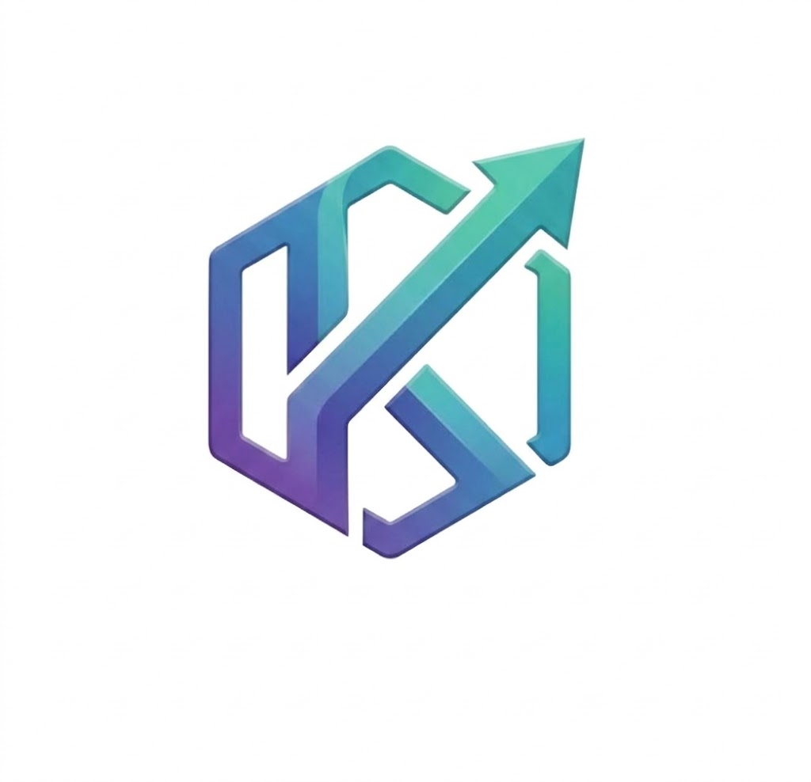
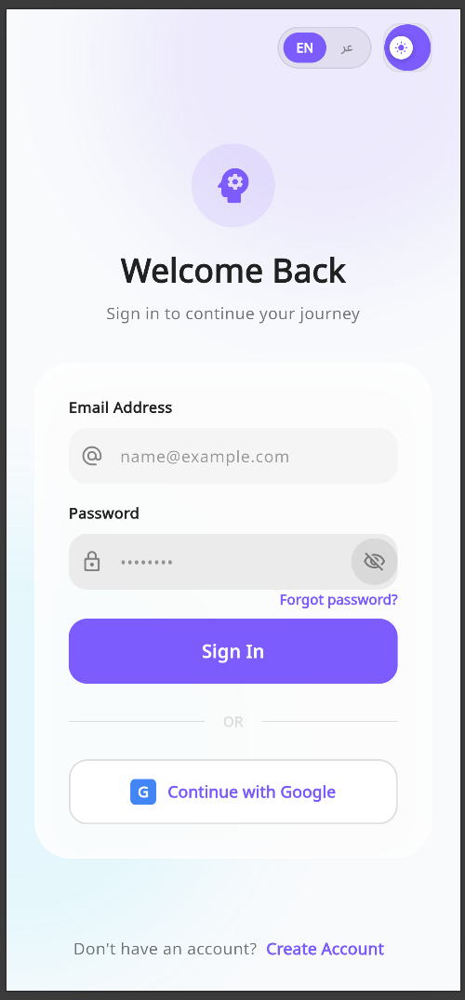
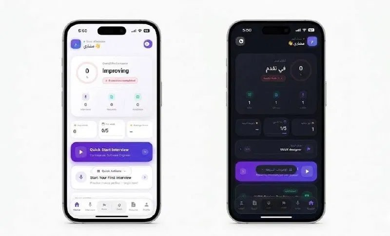
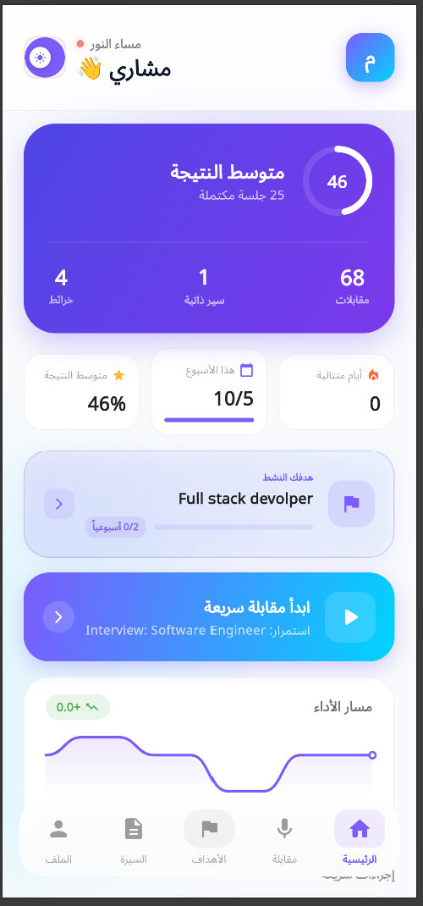
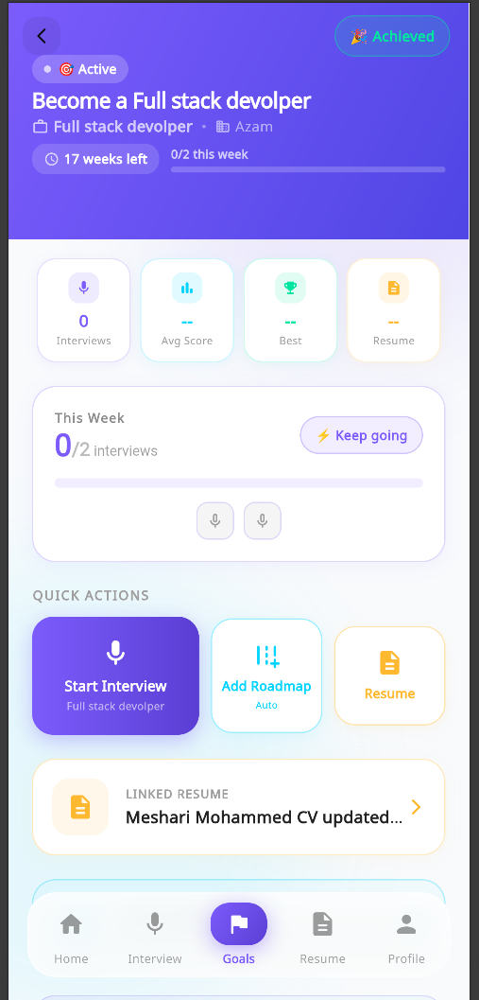
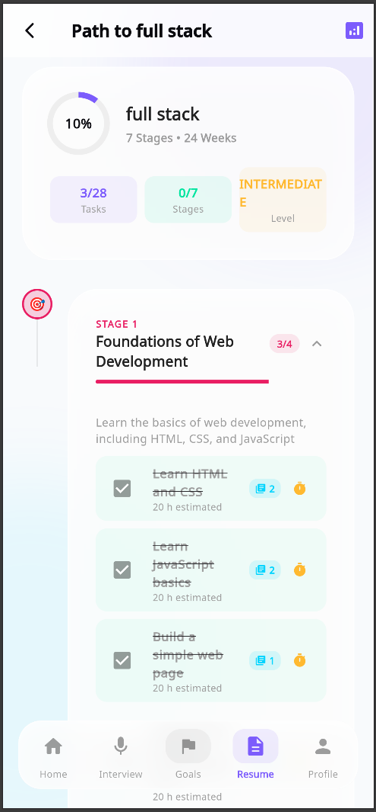
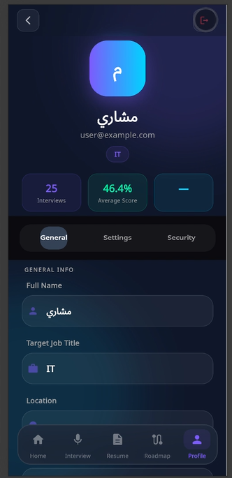
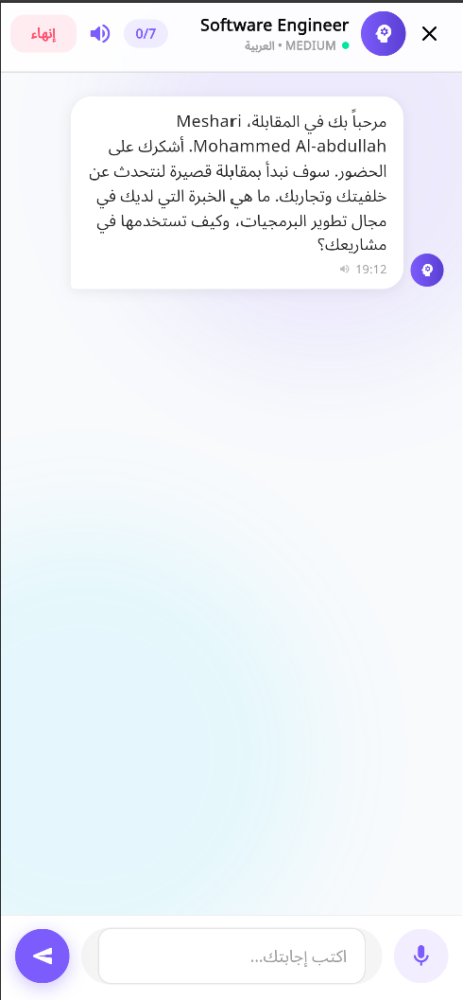
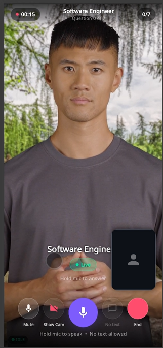

<div align="center">



# خطوة (Katwah) — AI Interview Prep Platform

**Practice smarter. Interview better. Land the job.**

A full-stack, bilingual (Arabic/English) AI-powered Job seeking preparation platform. Built with Flutter Web & Mobile + FastAPI.

[](https://flutter.dev)
[](https://fastapi.tiangolo.com)
[](https://groq.com)
[](LICENSE)

</div>

---

## 📱 Screenshots

<div align="center">

| Login | Home (EN) | Home (AR) |
|:-----:|:---------:|:---------:|
|  |  |  |

| Goals | Roadmap | Profile |
|:-----:|:-------:|:-------:|
|  |  |  |

| Interview Chat | Live Avatar Interview |
|:--------------:|:--------------------:|
|  |  |

</div>

---

## ✨ Features

### 🎯 AI Interview Simulation
- **Text Mode** — Type answers, get instant AI feedback
- **Voice Mode** — Speak naturally using device microphone (Groq Whisper STT)
- **Live Avatar Mode** — Full video interview with a D-ID AI avatar that speaks and responds in real time
- **Behavior Analysis** *(coming soon)* — Real-time analysis of interviewee confidence, nervousness, eye contact, and posture using face and hand detection during live video interviews

### 📄 Resume Intelligence
- Upload PDF/DOCX resumes
- 7-tab deep analysis: Overview, Analysis, ATS Score, Job Match, Design, AI Power, Question Predictor
- AI-powered resume builder (manual + AI-written modes)
- Radar chart skill visualization
- Resume variants (Professional / Aggressive / Technical tones)

### 🎯 Goals System
- Create career goals with target role, company, and deadline
- Weekly interview targets with streak tracking
- Auto-generate learning roadmaps tied to goals
- Link resumes to goals for targeted analysis
- Goal-aware AI interviews — questions tailored to your specific role
- Next-step AI recommendations based on progress

### 🗺️ Learning Roadmaps
- AI-generated personalized learning paths
- Stage-by-stage task tracking with completion
- Resource links per task
- Progress visualization

### 👤 Profile & Settings
- Full profile management (name, target role, industry)
- Performance stats (avg score, interviews done, streaks)
- Dark / Light theme toggle
- Arabic / English language toggle (full RTL support)

### 🔐 Authentication
- Email/password login & registration
- Google Sign-In
- JWT-secured sessions

---

## 🛠 Tech Stack

| Layer | Technology |
|-------|-----------|
| **Frontend** | Flutter 3.41.2 (Web + Android + iOS) |
| **State Management** | Riverpod |
| **Navigation** | GoRouter |
| **Backend** | FastAPI (Python) |
| **Database** | PostgreSQL + SQLAlchemy |
| **AI — Interviews** | Groq Llama 3.3 70B |
| **AI — Speech to Text** | Groq Whisper |
| **AI — Text to Speech** | OpenAI TTS |
| **AI — Avatar Video** | D-ID Talks API |
| **HTTP Client** | Dio |
| **Auth** | JWT + Google OAuth |

---

## 🚀 Getting Started

### Prerequisites

- Flutter SDK 3.41+
- Python 3.10+
- PostgreSQL
- API keys: Groq, OpenAI, D-ID

### Backend

```bash
cd backend
python -m venv venv
source venv/bin/activate        # Windows: .\venv\Scripts\Activate
pip install -r requirements.txt

# Copy and fill in your keys
cp .env.example .env

# Run migrations
alembic upgrade head

# Start server
uvicorn app.main:app --reload --host 0.0.0.0 --port 8000
```

### Frontend

```bash
cd frontend
flutter pub get

# Run on Chrome
flutter run -d chrome

# Run on Android emulator
flutter run
```

---

## 🌐 Bilingual Support

خطوة is fully bilingual with complete RTL layout support for Arabic.

- All UI strings translated (AR/EN)
- RTL-aware layouts using `Directionality`
- AI responses in the user's selected language
- Arabic-first design philosophy

---

## 📊 Behavior Analysis Feature *(In Development)*

During live video interviews, خطوة will analyze the interviewee in real time:

- **Confidence scoring** — posture, head position, eye contact
- **Nervousness detection** — hand movement, facial micro-expressions
- **Engagement tracking** — attention and focus over time
- **Post-interview report** — behavior breakdown alongside AI feedback

The user's face and hands must be visible to the camera for evaluation.

---

## 🗂 Project Structure

```
interview-prep-ai/
├── backend/
│   ├── app/
│   │   ├── models/          # SQLAlchemy models
│   │   ├── routers/         # API endpoints
│   │   ├── services/        # AI service layer
│   │   └── main.py
│   └── requirements.txt
└── frontend/
    └── lib/
        ├── core/            # Theme, routing, constants
        ├── features/        # Auth, Interview, Resume, Goals, Roadmap, Profile
        ├── services/        # API, TTS, Audio
        └── shared/          # Widgets, animations
```

---

## 📋 Roadmap

- [x] Authentication (email + Google)
- [x] Resume upload & 7-tab AI analysis
- [x] AI interview simulation (text + voice)
- [x] Live avatar video interviews (D-ID)
- [x] Goals system with goal-aware AI
- [x] Learning roadmaps
- [x] Profile & settings
- [x] Bilingual Arabic/English
- [x] Android mobile support
- [ ] Behavior analysis during video interviews
- [ ] iOS App Store release
- [ ] Production deployment
- [ ] Push notifications

---

## 🤝 Contributing

Pull requests are welcome. For major changes, please open an issue first.

---

## 📄 License

MIT License — see [LICENSE](LICENSE) for details.

---

<div align="center">

Built with ❤️ in Saudi Arabia 🇸🇦

**خطوة** — Every journey starts with a single step.

</div>
