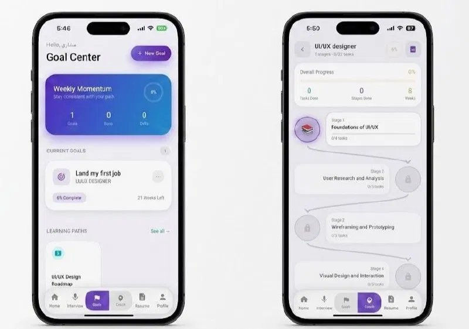
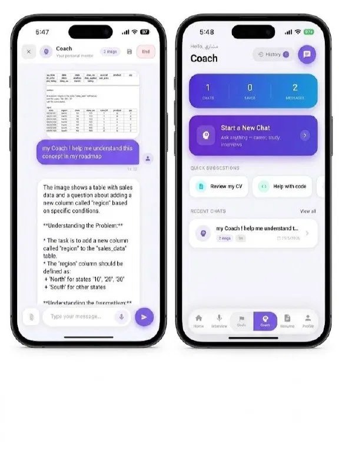
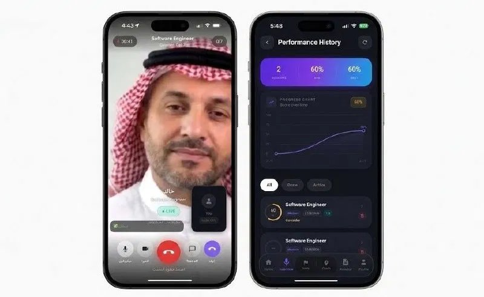
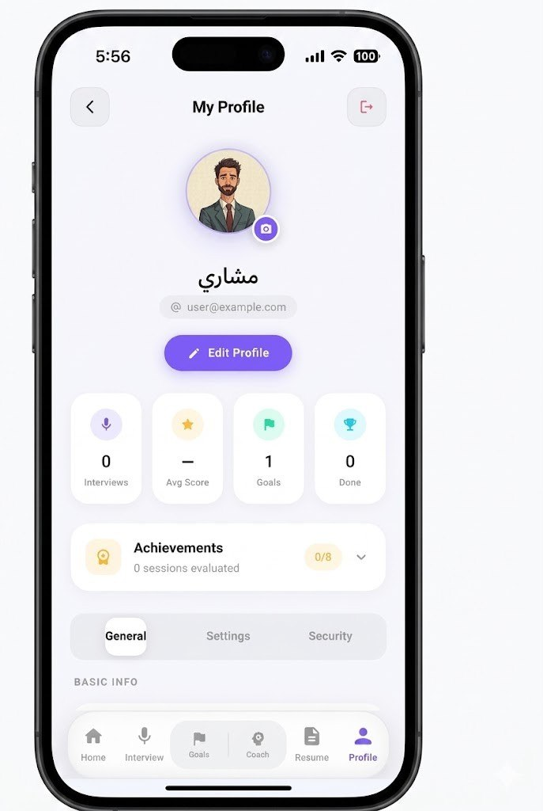

<div align="center">


# خطوة (Katwah) — AI Career Readiness Platform

**Practice smarter. Interview better. Land the job.**

A full-stack, bilingual (Arabic/English) AI-powered career readiness platform.  
Built with Flutter (Android/iOS) + FastAPI backend.

[](https://flutter.dev)
[](https://fastapi.tiangolo.com)
[](https://groq.com)
[](https://anam.ai)
[](LICENSE)

</div>

---

## 📱 App Screenshots

> **How to add screenshots:**
> 1. Create a `screenshots/` folder in the root of the repo
> 2. Save each image with the filename shown below
> 3. Push to GitHub — images will appear automatically

---

### 🏠 Home Screen (Light & Dark)

Place image → `screenshots/home.png`

| Light Mode | Dark Mode (Arabic) |
|:----------:|:------------------:|
|  | *(dark mode screenshot)* |

> **Image source:** `home.png` — the side-by-side light/dark home screenshot you provided

---

### 🎯 Goals & Roadmap

Place image → `screenshots/goals_roadmap.png`

<div align="center">

</div>

> **Image source:** `goals_roadmap.png` — the Goals Center + Roadmap Journey side-by-side screenshot

---

### 🤖 AI Coach

Place image → `screenshots/coach.png`

<div align="center">

</div>

> **Image source:** `coach.png` — the Coach chat + Coach Hub side-by-side screenshot

---

### 🎥 Live Avatar Interview & Performance History

Place image → `screenshots/interview_avatar.png`

<div align="center">

</div>

> **Image source:** `interview_avatar.png` — Khalid avatar live interview + Performance History screenshot

---

### 📄 Resume Hub & AI Enhancement

Place image → `screenshots/resume.png`

<div align="center">

</div>

> **Image source:** `resume.png` — Resume Hub + Enhance Resume side-by-side screenshot

---

### 👤 Profile

Place image → `screenshots/profile.png`

<div align="center">

</div>

> **Image source:** `profile.png` — My Profile screenshot

---

## ✨ Features

### 🎯 AI Interview Simulation
- **Text Mode** — Type answers, get instant AI feedback
- **Voice Mode** — Speak naturally using device microphone (Groq Whisper STT)
- **Live Avatar Mode** — Full video interview with خالد, an Arabic AI avatar (Anam.ai) that speaks and responds in real time in Arabic
- **Behavior Analysis** — Real-time analysis of confidence, nervousness, eye contact, and posture

### 📊 Rich Feedback & Performance History
- Animated score ring with grade badge and recommendation label
- Score breakdown: Communication, Technical, Confidence
- Per-question analysis with best/weakest answer markers
- Progress chart tracking score trends over time
- Voice analysis: clarity, pace, filler word detection
- **Personal AI Coach Tips** — personalized tips based on behavioral data
- Bilingual feedback (Arabic/English)

### 📄 Resume Intelligence
- Upload PDF/DOCX resumes
- Multi-tab deep analysis: Overview, ATS Score, Job Match, AI Enhancement
- AI-powered resume builder (manual + AI-written modes)
- Cover letter generation

### 🎯 Goals System
- Create career goals with target role, company, and deadline
- Weekly interview targets with streak tracking
- Auto-generate learning roadmaps tied to goals
- Goal-aware AI interviews — questions tailored to your specific role

### 🗺️ Learning Roadmaps
- AI-generated personalized learning paths
- Stage-by-stage task tracking with completion
- Resource links per task
- Progress visualization with S-curve journey map

### 🤖 AI Coach
- Personal AI mentor for career questions
- Chat history and saved responses
- Quick suggestions: Review CV, Help with code, Interview prep
- Bilingual coaching (Arabic/English)

### 👤 Profile & Settings
- Full profile management
- Performance stats (avg score, interviews done, streaks)
- Achievements system (0/8 badges)
- Dark / Light theme toggle
- Arabic / English language toggle (full RTL support)

### 🔐 Authentication
- Email/password login & registration
- JWT-secured sessions

---

## 🛠 Tech Stack

| Layer | Technology |
|-------|-----------|
| **Frontend** | Flutter 3.41.2 (Android + iOS) |
| **State Management** | Riverpod |
| **Navigation** | GoRouter |
| **Backend** | FastAPI (Python) |
| **Database** | PostgreSQL (Railway) |
| **AI — Interviews** | Groq Llama 3.3 70B |
| **AI — Vision/Behavior** | Groq Llama 3.2 11B Vision |
| **AI — Speech to Text** | Groq Whisper Large v3 |
| **AI — Text to Speech** | OpenAI TTS |
| **AI — Live Avatar** | Anam.ai (خالد — Arabic male avatar) |
| **HTTP Client** | Dio |
| **Auth** | JWT |
| **Hosting** | Railway |

---

## 🚀 Getting Started

### Prerequisites

- Flutter SDK 3.41+
- Python 3.10+
- PostgreSQL
- API keys: Groq, OpenAI, Anam.ai

### Backend

```bash
cd backend
python -m venv venv
.\venv\Scripts\activate        # Windows
# source venv/bin/activate     # Mac/Linux

pip install -r requirements.txt

# Copy and fill in your keys
cp .env.example .env

# Start server
uvicorn app.main:app --reload --host 0.0.0.0 --port 8000
```

### Frontend

```bash
cd frontend
flutter pub get

# Run on Android emulator
flutter run

# Run on physical device
flutter run --release
```

---

## 🌐 Bilingual Support

خطوة is fully bilingual with complete RTL layout support for Arabic.

- All UI strings translated (AR/EN)
- RTL-aware layouts using `Directionality`
- AI responses in the user's selected language
- Arabic-first design philosophy
- Live avatar (خالد) speaks native Arabic

---

## 📊 Behavior Analysis

During live video interviews, خطوة analyzes the interviewee in real time:

- **Confidence scoring** — posture, head position, eye contact
- **Nervousness detection** — hand movement, facial micro-expressions
- **Voice analysis** — clarity, pace, filler word detection (Groq Whisper + LLM)
- **Personal AI Coach Tips** — generated from real behavioral data
- **Post-interview report** — full behavior breakdown alongside AI answer feedback
- Camera frames analyzed every 4 seconds using Groq vision LLM
- Combined score: Camera 35% + Voice 30% + Answer Quality 35%

---

## 🗂 Project Structure

```
interview-prep-ai/
├── backend/
│   ├── app/
│   │   ├── models/          # SQLAlchemy models
│   │   ├── routers/         # API endpoints
│   │   ├── services/        # AI service layer (Groq, Anam, TTS)
│   │   └── main.py
│   └── requirements.txt
└── frontend/
    └── lib/
        ├── core/            # Theme, routing, constants
        ├── features/        # Auth, Interview, Resume, Goals, Roadmap, Coach, Profile
        ├── services/        # API, TTS, Audio, Behavior
        └── shared/          # Widgets, animations, transitions
```

---

## 📋 Roadmap

- [x] Authentication (email + password)
- [x] Resume upload & AI analysis (ATS, Job Match, Enhancement)
- [x] Cover letter generation
- [x] AI interview simulation (text + voice)
- [x] Live avatar video interviews (Anam.ai — خالد)
- [x] Goals system with goal-aware AI
- [x] Learning roadmaps with stage tracking
- [x] AI Coach with chat history
- [x] Profile & achievements
- [x] Bilingual Arabic/English (full RTL)
- [x] Android mobile support
- [x] Behavior analysis (camera + voice + coach tips)
- [x] Performance history with progress chart
- [x] Career DNA onboarding quiz
- [ ] iOS App Store release
- [ ] Push notifications
- [ ] Offline mode

---

## 🤝 Contributing

Pull requests are welcome. For major changes, please open an issue first.

---

## 📄 License

MIT License — see [LICENSE](LICENSE) for details.

---

<div align="center">

Built with ❤️ in Saudi Arabia 🇸🇦

**خطوة** — Every journey starts with a single step.

</div>
